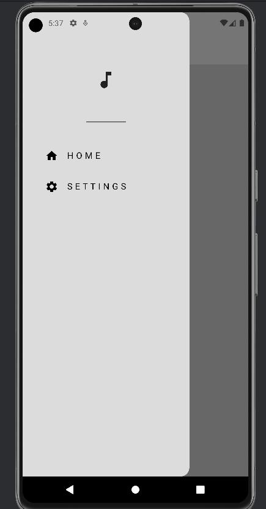

# Melodify - Your Music Player App

Melodify is a simple yet powerful music player app built with Flutter that allows you to listen to your favorite songs anytime, anywhere. Whether you're jogging in the park, commuting to work, or simply relaxing at home, Melodify provides the perfect soundtrack for your day.

## Features

- **Customizable Themes**: Choose from a variety of themes to personalize your music player experience( light /dark) themes.
- **Offline Playback**: listen songs offline.
- **Cross-Platform**: Melodify is available on both Android and iOS devices.

## Screenshots




## Installation

1. Clone the repository:

   ```bash
   git clone https://github.com/amannnyadav/Melodify.git

